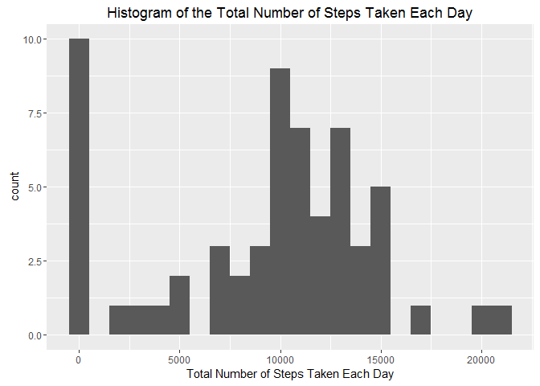
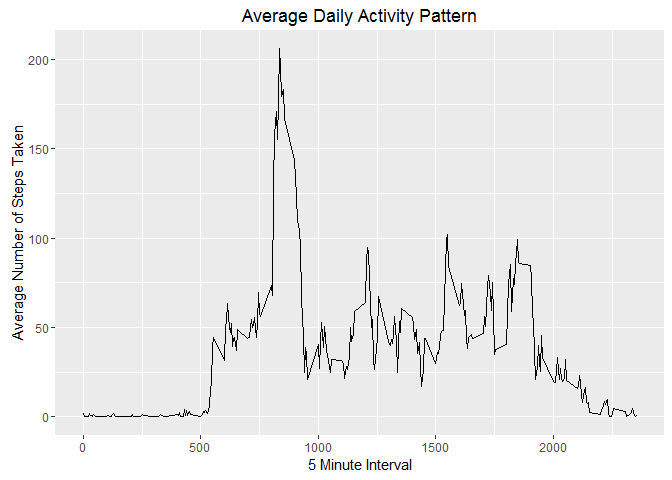
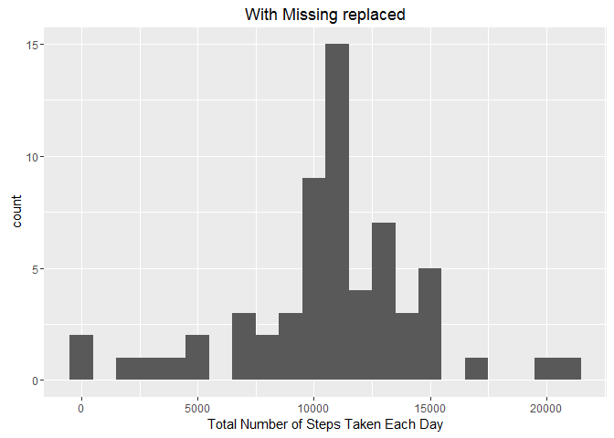
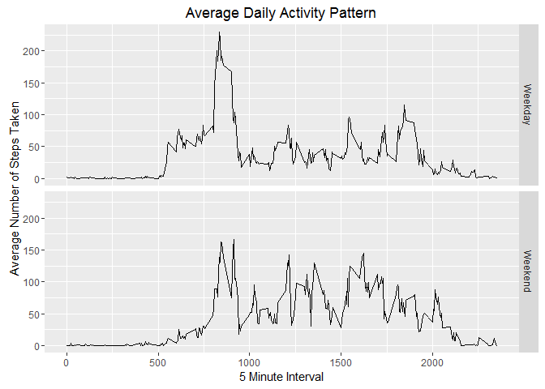
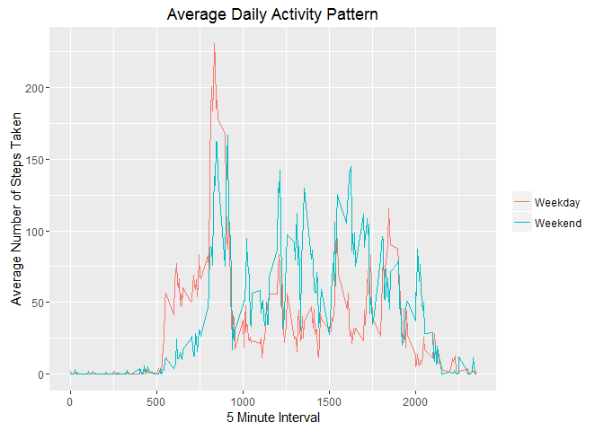

# Reproducible Research: Peer Assessment 1


## Loading and preprocessing the data


```r
unzip(zipfile = "activity.zip")
activity <- read.csv("activity.csv", header = TRUE, sep = ",")    
```

## What is mean total number of steps taken per day?

##### 1. Make a histogram of the total number of steps taken each day


```r
library(ggplot2)
total_steps <- tapply(activity$steps, activity$date, sum, na.rm = TRUE)
qplot(total_steps, binwidth = 1000, xlab = "Total Number of Steps Taken Each Day"
      , main = "Histogram of the Total Number of Steps Taken Each Day")
```

<!-- -->

##### 2. Calculate and report the mean and median total number of steps taken per day


```r
mean(total_steps)
```

```
## [1] 9354.23
```

```r
median(total_steps)
```

```
## [1] 10395
```

The mean number of steps is 9,354 and the median number of steps is 10,395 per day


## What is the average daily activity pattern?

##### 1. Make a time series plot (i.e. type = "l") of the 5-minute interval (x-axis) and the average number of steps taken, averaged across all days (y-axis)


```r
library(dplyr)
```

```
## Warning: package 'dplyr' was built under R version 3.3.1
```

```
## 
## Attaching package: 'dplyr'
```

```
## The following objects are masked from 'package:stats':
## 
##     filter, lag
```

```
## The following objects are masked from 'package:base':
## 
##     intersect, setdiff, setequal, union
```

```r
activity_steps <- activity %>% 
              group_by(interval) %>%
              summarise(mean_steps = mean(steps, na.rm = TRUE))

ggplot(data = activity_steps, aes(x = interval, y = mean_steps)) + geom_line() + xlab("5 Minute Interval") + ylab("Average Number of Steps Taken") + ggtitle( "Average Daily Activity Pattern")
```

<!-- -->

##### 2. Which 5-minute interval, on average across all the days in the dataset, contains the maximum number of steps?


```r
max_steps <- which.max(activity_steps$mean_steps)

activity_steps[max_steps,]
```

```
## # A tibble: 1 x 2
##   interval mean_steps
##      <int>      <dbl>
## 1      835   206.1698
```

The 5 minute interval with the maximum number of steps is interval 835 with 206 steps


## Imputing missing values

##### 1. Calculate and report the total number of missing values in the dataset (i.e. the total number of rows with NAs)


```r
sum(is.na(activity$steps))
```

```
## [1] 2304
```

There are 2,304 missing values


##### 2. Devise a strategy for filling in all of the missing values in the dataset. The strategy does not need to be sophisticated. For example, you could use the mean/median for that day, or the mean for that 5-minute interval, etc.

use the mean for that 5 minute interval to fill in NAs (utilise activity_steps created earlier)


##### 3. Create a new dataset that is equal to the original dataset but with the missing data filled in.


```r
activity_missing <- merge(activity, activity_steps, by = 'interval') %>%
                    mutate(steps = ifelse(is.na(steps),mean_steps,steps))
```


##### 4. Make a histogram of the total number of steps taken each day and Calculate and report the mean and median total number of steps taken per day. Do these values differ from the estimates from the first part of the assignment? What is the impact of imputing missing data on the estimates of the total daily number of steps?


```r
total_steps_missing <- tapply(activity_missing$steps, activity_missing$date, sum)
qplot(total_steps_missing, binwidth = 1000, xlab = "Total Number of Steps Taken Each Day"
      , main = "With Missing replaced")
```

<!-- -->

```r
mean(total_steps_missing)
```

```
## [1] 10766.19
```

```r
median(total_steps_missing)
```

```
## [1] 10766.19
```

The mean and median total number of steps per day are both 10,766 after replacing NAs with interval average. The mean value went up from 9,354 and the median went up by a smaller amount from 10,395.


## Are there differences in activity patterns between weekdays and weekends?


```r
activity_day <- activity_missing %>%
                mutate(wkend_wkday = ifelse(weekdays(as.Date(date)) %in% c("Saturday","Sunday"),"Weekend","Weekday"))

activity_day_1 <- activity_day %>% 
              group_by(wkend_wkday, interval) %>%
              summarise(mean_steps = mean(steps))

ggplot(data=activity_day_1, aes(interval, mean_steps)) + geom_line() + facet_grid(wkend_wkday ~ .) + xlab("5 Minute Interval") + ylab("Average Number of Steps Taken") + ggtitle( "Average Daily Activity Pattern")
```

<!-- -->


Graph Version on the same y-axis

```r
ggplot(data = activity_day_1, aes(interval, mean_steps)) + geom_line(aes(group = wkend_wkday, colour = wkend_wkday)) + xlab("5 Minute Interval") + ylab("Average Number of Steps Taken") + ggtitle( "Average Daily Activity Pattern") + theme(legend.title=element_blank())
```

<!-- -->
